# Lab5

## Creación del bucket y sus carpetas
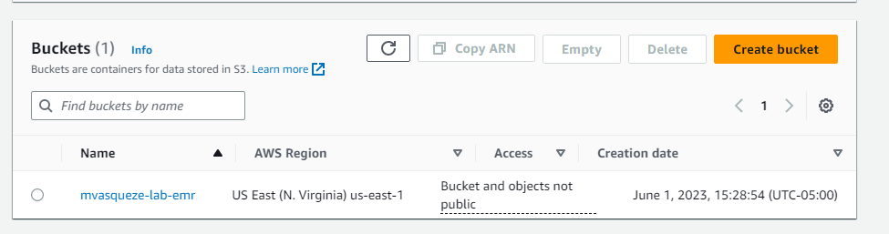

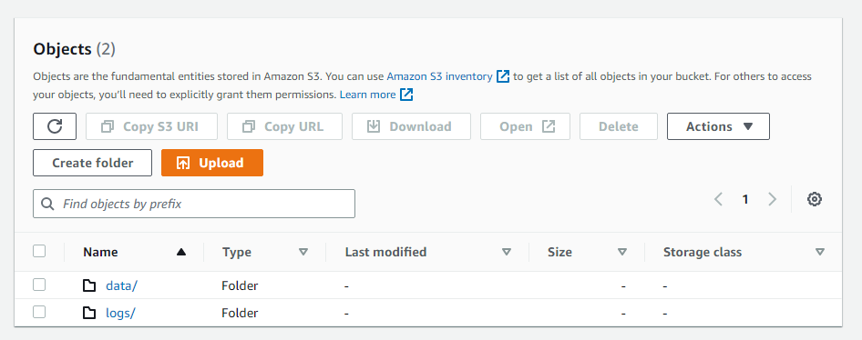

## Creación de la key
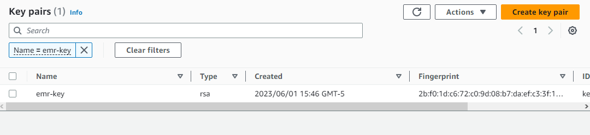
Creación de la key

## Creación del cluster
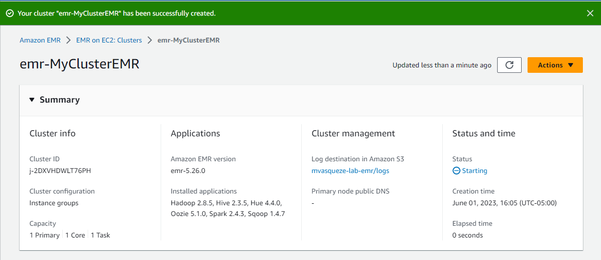

## Ingreso a la interfez web, creación del perfil y constancia de la creación del S3
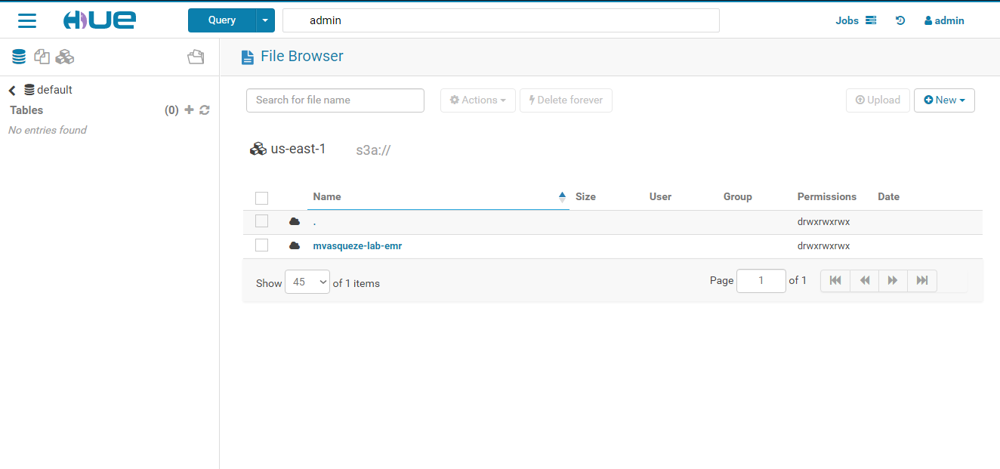

## Creación y uploading via interfaz web del .txt
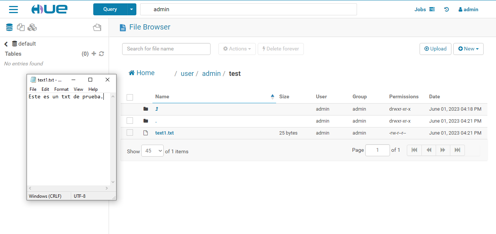

## Creación del segundo directorio a través de la consola
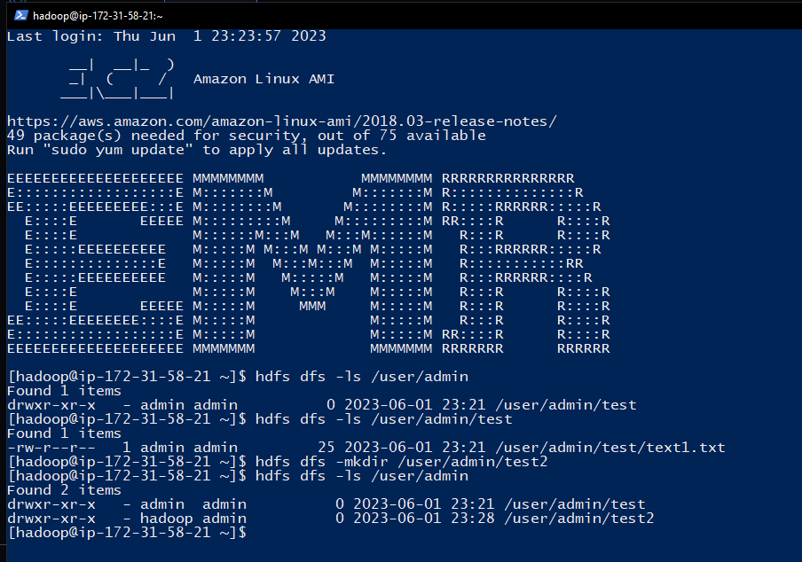

El comando usado para la creación del directorio es es siguiente:

```
hdfs dfs -mkdir /user/admin/test2
$ hdfs dfs -ls /user/admin
```

Constancia de la creación del directorio desde la interfaz web
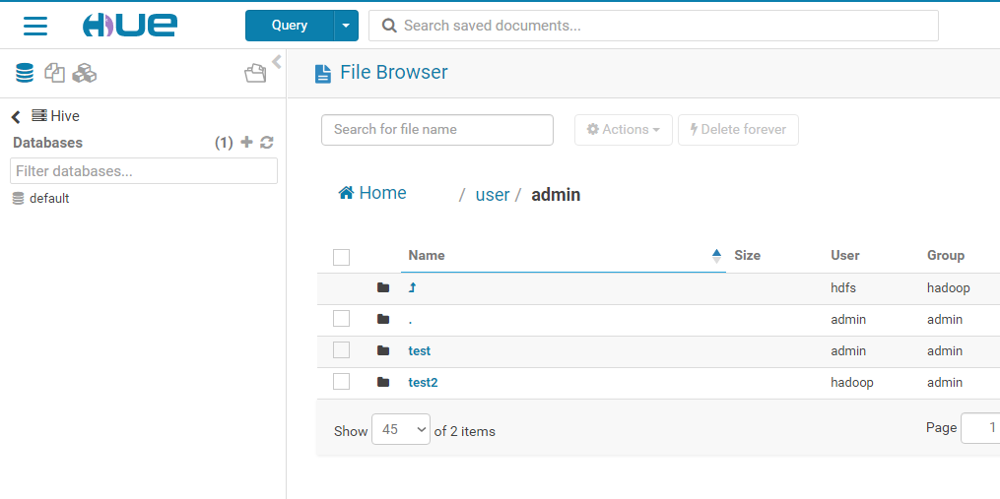

## Creación y subida del segundo archivo

Segundo archivo ya existente en la consola
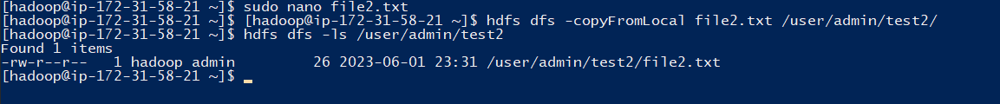

El archivo fue creado con:
```
$ sudo nano file2.txt
```

Y fue trasladado a la carpeta deseada con:
```
hdfs dfs -copyFromLocal file2.txt /user/admin/test2/
```

Constancia de creación desde la interfaz web
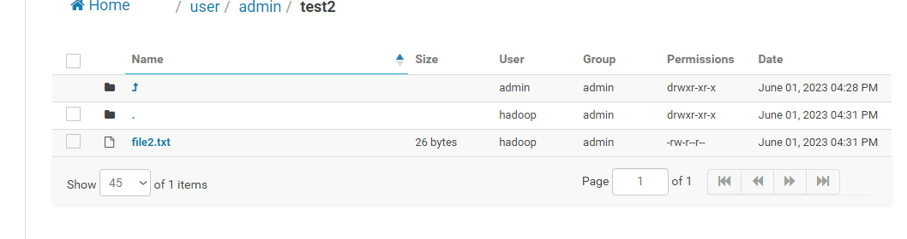


# Laboratorio 6

## Reto 1
Inicialmente, abro una consola de powershell y ejecuto el comando 

```
pip install awscli
```
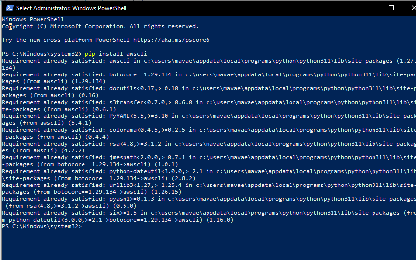

Una vez instalado el CLI, ingreso a la ruta donde está almacenado (en mi caso This PC/Users/MiUsuario/AWS) y modifico el archivo config.txt y credentials.txt.

### Credentials 
Ingreso a la página principal del laboratorio, lo inicio y doy clic en "AWS details" y luego en el botón "Show".

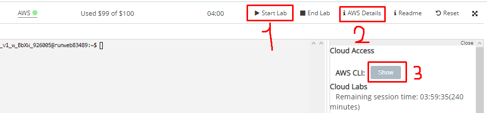

La información contenida en en apartado "AWS CLI" debe ser copiada y pegada en credentials.txt
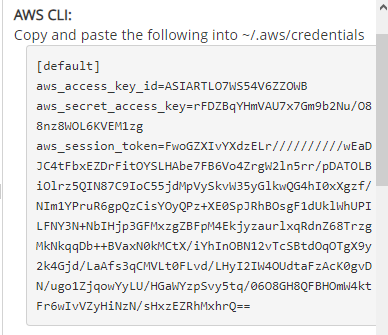

### Config

Posteriormente, en el mismo apartado del pánel del laboratorio, después de las credenciales se encuentra la región. 
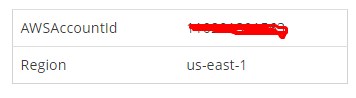

Es necesario incluir la información de la región en el archivo config.txt:

```
[default]
region = us-east-1
```

Quedarían los archivos de la siguiente manera:
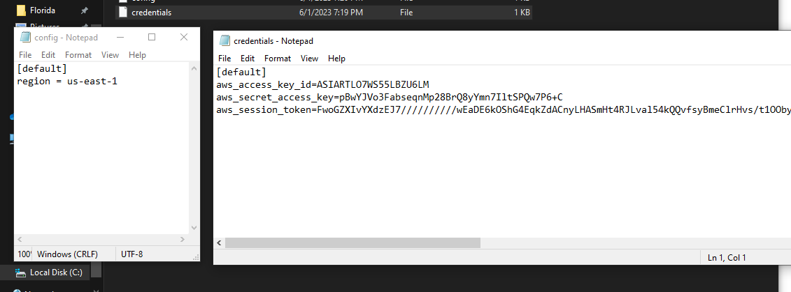

Posteriormente, se corre el siguiente comando:

```
aws emr create-cluster --release-label emr-6.10.0 --instance-type m4.large --instance-count 3 --log-uri s3://mvasqueze-lab-emr/logs --use-default-roles --ec2-attributes KeyName=emr-key,SubnetId=subnet-0f42d1e0fb0273f9d --no-termination-protected
```
Los espacios designados para la URI, el KeyName y Subnet ID deben ser reemplazados en concordancia con el S3, el .pem y una de las subnets que se posean.

Tras ejecutar dicho comando, debe aparecer algo similar a lo siguiente en consola:
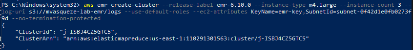

Esto indica que el cluster de tres instancias fue creado correctamente. A continuación, verificamos en la consola de AWS:
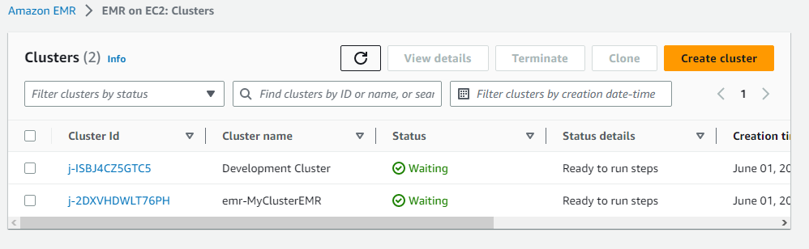


## Reto 2

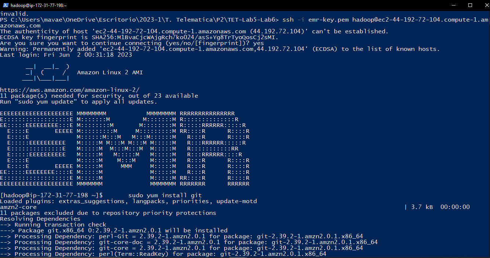
Abro otra terminal, conecto con el nodo principal del cluster y le instalo git

```
ssh -i emr—key.pem hadoop@ec2-44-192-72-104.compute—l.amazonaws.com
sudo yum install git
```

Posteriormente, clono el respectivo repositorio
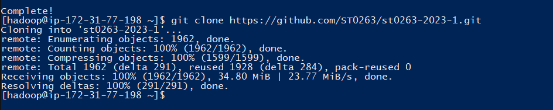

```
git clone https://github.com/ST0263/st0263-2023-1.git
```
Luego, luego de modificar wordcount local debido a un error con las minúsculas, ejecuto wordcount-local sobre el dataset gutemberg-small

```
cd st0263-2023-1/Laboratorio\ N6-MapReduce/wordcount/
python wordcount-local.py /home/hadoop/st0263-2023-1/datasets/gutenberg-small/*.txt | sudo tee salida-serial.txt > /dev/null
more salida-serial.txt
```
El output fue el siguiente:
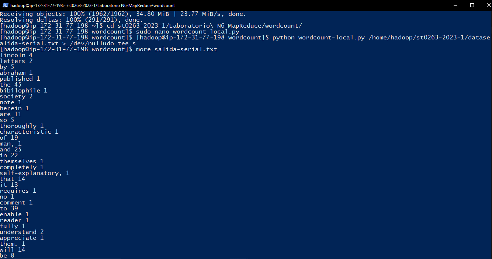

A continuación vamos a correr MrJob en local, para lo cual necesitamos instalar python y la librería de MrJob:

```
sudo yum install python3-pip
sudo pip3 install mrjob
cd wordcount
python wordcount-mr.py ./datasets/gutenberg-small/*.txt
```

Resultado luego de correr Mr. Job en local.
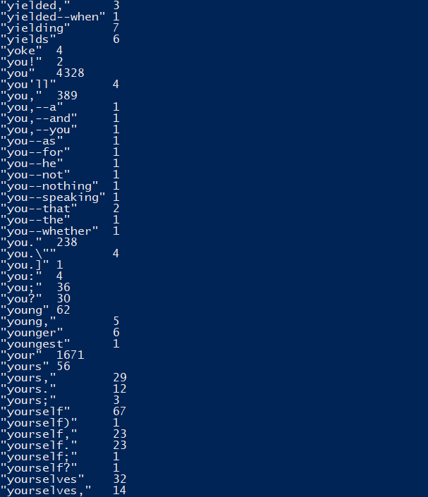

Luego de copiar los datasets en el EMR, estos son entregado al Mr. Job y este es el output que se almacena en el EMR.
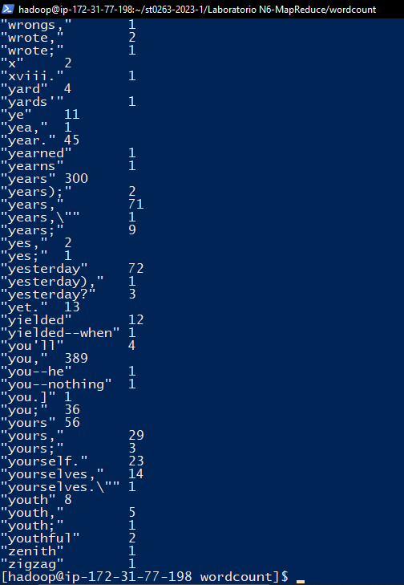

#Reto 3

##1.1
Usando el comando
python salarioPromSecEc.py hdfs:///user/admin/datasets/otros/dataempleados.txt -r hadoop --output-dir hdfs:///user/admin/p1-1

Se obtuvieron los siguientes outputs:
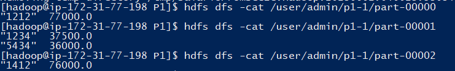


##1.2
Usando el comando
 python salarioProm.py hdfs:///user/admin/datasets/otros/dataempleados.txt -r hadoop --output-dir hdfs:///user/admin/p1-2
 
 

## 1.3

Usando el comando
 python secEmp.py hdfs:///user/admin/datasets/otros/dataempleados.txt -r hadoop --output-dir hdfs:///user
/admin/p1-3

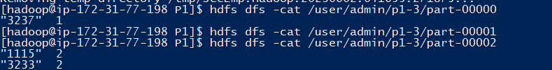

#Reto 2

## 2.1
Con el comando

 python diaMinMax.py hdfs:///user/admin/datasets/otros/dataempresas.txt -r hadoop --output-dir hdfs:///user/admin/p2-1
 
 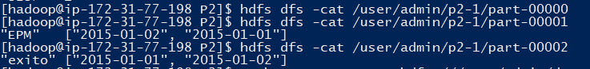

## 2.2
Con el comando 
 python accUpDown.py hdfs:///user/admin/datasets/otros/dataempresas.txt -r hadoop --output-dir hdfs:///us
er/admin/p2-2

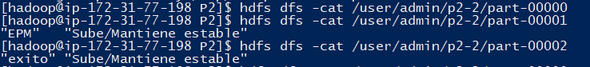

## 2.3
Con el comando
python blackDay.py hdfs:///user/admin/datasets/otros/dataempresas.txt -r hadoop --output-dir hdfs:///use
r/admin/p2-3

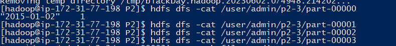

#Reto 3

##3.1
Con el comando
 python pelUsuarioRating.py hdfs:///user/admin/datasets/otros/datapeliculas.txt -r hadoop --output-dir hdfs:///user/admin/p3-1
 
 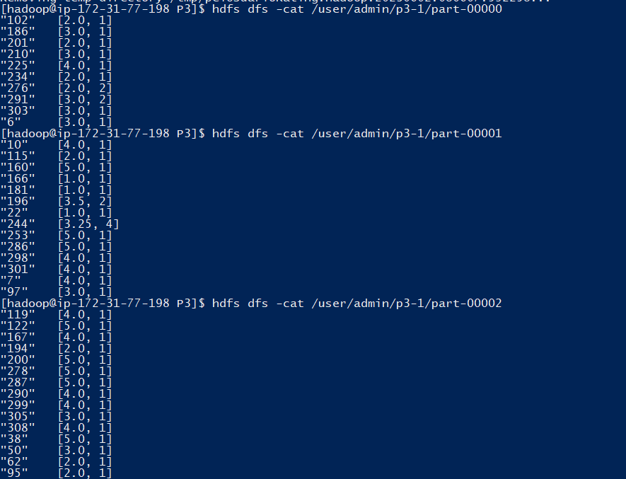

##3.2
Con el comando
 python masPel.py hdfs:///user/admin/datasets/otros/datapeliculas.txt -r hadoop --output-dir hdfs:///user
/admin/p3-2

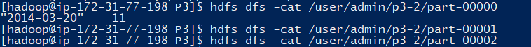

##3.3
Con el comando
python menosPel.py hdfs:///user/admin/datasets/otros/datapeliculas.txt -r hadoop --output-dir hdfs:///us
er/admin/p3-3

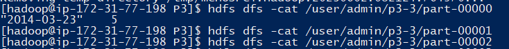

##3.4
Con el comando

python singlePel.py hdfs:///user/admin/datasets/otros/datapeliculas.txt -r hadoop --output-dir hdfs:///u
ser/admin/p3-4

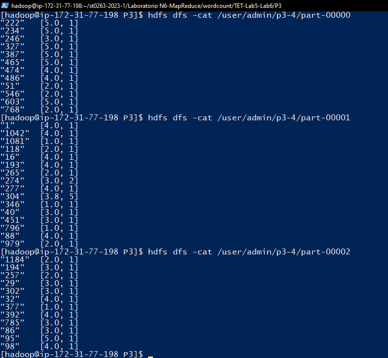

##3.5
Con el comando
 python peorProm.py hdfs:///user/admin/datasets/otros/datapeliculas.txt -r hadoop --output-dir hdfs:///us
er/admin/p3-5

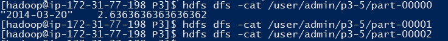

##3.6
Con el comando
python mejorProm.py hdfs:///user/admin/datasets/otros/datapeliculas.txt -r hadoop --output-dir hdfs:///u
ser/admin/p3-6

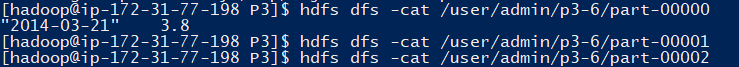

##3.7
Con el comando
 python genero.py hdfs:///user/admin/datasets/otros/datapeliculas.txt -r hadoop --output-dir hdfs:///user
/admin/p3-7

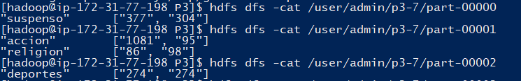

 
